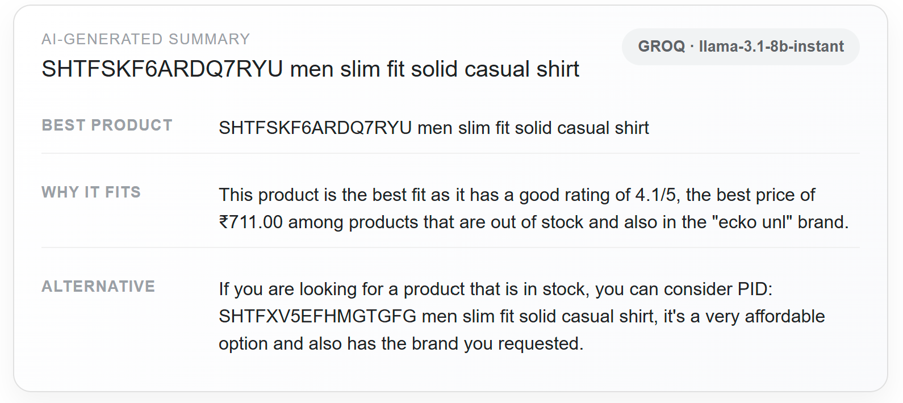
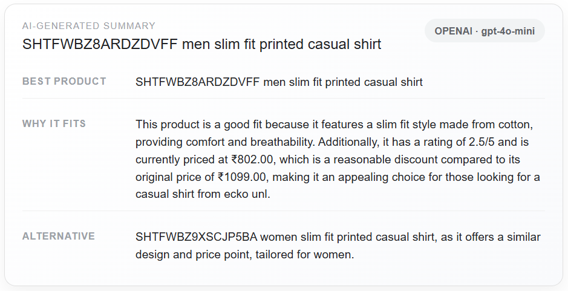
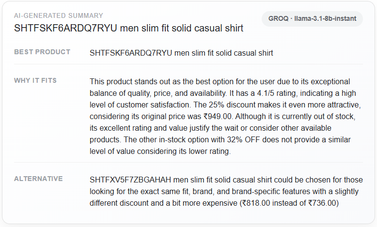
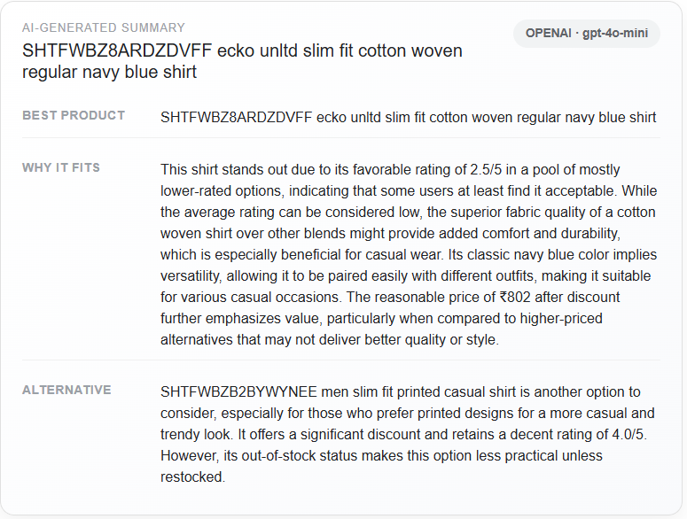

# Part 4: RAG, User Interface and Web Analytics
**Github URL**: https://github.com/aniolpetit/irwa-2025-group06

**Github TAG**: IRWA-2025-part-4

**Date:** November 29, 2025

---

## Table of Contents

1. [Introduction](#1-introduction)
2. [User Interface](#2-user-interface)
   - 2.1 [Search Page](#21-search-page)
   - 2.2 [Search Algorithms Integration](#22-search-algorithms-integration)
   - 2.3 [Results Page](#23-results-page)
   - 2.4 [Document Details Page](#24-document-details-page)
3. [RAG Implementation](#3-rag-implementation)
4. [Web Analytics](#4-web-analytics)
5. [Conclusion](#5-conclusion)

---

## 1. Introduction

This report documents the implementation of Part 4 of the IRWA Final Project, which focuses on creating a complete web application with Retrieval-Augmented Generation (RAG), a user-friendly interface, and web analytics capabilities. The application provides users with an intuitive search interface for fashion products, AI-powered recommendations, and comprehensive usage statistics.

---

## 2. User Interface

### 2.1 Search Page

The search page was enhanced to provide a better user experience. The HTML structure was reorganized to create a more prominent and centered search interface. A descriptive page title was added above the search form to guide users. The search input field was made more prominent with improved sizing and clearer placeholder text. The form layout was restructured to ensure proper alignment between the input field and search button.

Client-side validation was implemented to prevent users from submitting empty queries, replacing the previous non-functional validation. Additional CSS styling was added to improve the visual presentation, including better centering of the search interface, responsive design considerations, and enhanced visual feedback through focus states and hover effects.

### 2.2 Search Algorithms Integration

PREGUNTA: ÉS MILLOR FER SERVIR TF-IDF OR BM25?

The search functionality was integrated with the TF-IDF ranking algorithm developed in Part 2. A new `SearchAlgorithm` class was created in `myapp/search/algorithms.py` to wrap the TF-IDF ranker and inverted index, making them suitable for web application use. The implementation loads the processed corpus data (which contains preprocessed tokens) and builds the inverted index at initialization time for optimal performance.

The `SearchEngine` class was refactored to use the integrated search algorithm instead of the dummy random search. The search process now performs proper query preprocessing, conjunctive query filtering, and TF-IDF-based ranking to return the most relevant results. The algorithm is initialized once at application startup, ensuring fast response times for user queries.

To ensure accurate result display, the search engine retrieves document data directly from the processed corpus used for indexing, rather than a separate display corpus. This guarantees that all document fields (including descriptions, metadata, and product details) are available and consistent with the indexed data. A fallback mechanism was implemented for description fields: if the primary description is missing, the system falls back to the full text field, and if that is also unavailable, it uses the title as a last resort.

The results template was updated to properly handle missing or None values. Date fields are only displayed when available, and descriptions show appropriate fallback messages when data is missing. The Document model was extended to include ranking scores and additional fields needed for result display, including proper handling of optional fields like crawled dates.

### 2.3 Results Page

The results page was enhanced to display comprehensive product information for each search result. The template was restructured to show all required document properties including title, description, selling price, discount percentage, average rating, and product metadata such as brand and category. Additional relevant information was added including stock availability status and original price display when discounts are available.

The Document model was extended with an `original_url` field to separate the document details page URL from the original product website URL. The title link was configured to navigate to the document details page, while a separate "View on original website" link was added to access the original product page. This separation allows users to access both detailed product information within the application and the original source.

Spacing between metadata fields was improved to enhance readability. The layout was organized with proper visual separation between different information elements, making it easier for users to scan and understand product details. Price formatting was implemented to display currency values appropriately, and rating displays were enhanced with visual indicators.

### 2.4 Document Details Page

A comprehensive document details page was implemented to display complete product information. The route was updated to retrieve document data from the processed corpus, ensuring all available fields are accessible. The page uses a two-column layout with the main content area showing product images, description, and product details, while a sidebar displays pricing, product information, rating, and availability.

Navigation functionality was added with two buttons at the top: one to return to the search page and another to go back to the search results for the same query. The "Back to Results" button uses a form submission to resubmit the last search query, allowing users to continue browsing results from the same search session.

Product images were made interactive with a modal lightbox feature. Clicking on any image opens a modal overlay displaying the image at a larger size while maintaining aspect ratio. The modal is centered on screen and can be closed by clicking the close button, clicking outside the image, or pressing the Escape key.

The page displays all relevant document properties prominently, including title, description, images, pricing, discount, rating, brand, category, seller, and stock status. An "Additional Information" section was added at the bottom to display less prominent metadata such as product ID, document ID, crawled timestamp, and full text, using smaller font sizes and muted colors to maintain visual hierarchy while ensuring all available information is accessible.

## 3. RAG Implementation

The Retrieval-Augmented Generation (RAG) layer lives in `myapp/generation/rag.py` and now boots both Groq and OpenAI clients based on environment variables (`GROQ_API_KEY`, `OPENAI_API_KEY`, `LLM_PROVIDER`). When the `/search` route finishes TF-IDF ranking, those `Document` objects are serialized with price, rating, stock and brand metadata, spliced into a sturdy prompt template, and dispatched to whichever client is available. The generator returns the text together with the model metadata so the UI can disclose which LLM produced the recommendation.

### 3.1 First working version (Groq baseline)

We first wired the app to Groq's `llama-3.1-8b-instant` model because Groq's Python SDK is lightweight and matches the OpenAI chat completion schema, so the only code we needed was the `Groq(api_key=...)` client factory plus a fallback message when credentials are missing. Once the key was stored in `.env`, the RAG block in the results page began to render multi-sentence summaries such as the one below.

The baseline already highlighted the PID, quoted the 25 % discount, and suggested an alternative. However, the copy was unstructured (single paragraph) and sometimes recommended out-of-stock items without pointing that out, so we captured metrics to guide further refinement.

### 3.2 Techniques we explored for better answers

1. **Change response format** - This really does not affect the content of the LLM summary as such, but it really improved readibility and made it much more understandable. You can compare the previous image with the original formatting against our new format in the following image:

2. **Alternative model (OpenAI)** – We added optional initialization of `OpenAI(api_key=...)` and let `LLM_PROVIDER` express a preference order. This made it trivial to compare Groq and OpenAI outputs on identical retrieval contexts, so we could see how using different models affects the output.
3. **Prompt refinement** – The original prompt simply asked for “best product” and “alternative”. We rewrote it to emphasise critical comparison, practical benefits, and explicit justification for why the winning item beats the alternative. We also nudged the model to call out stock issues rather than ignoring them.

### 3.3 How the iterations changed the output

To measure the effect of each change we recorded the UI after every iteration and analysed the pros and cons of each snapshot.

*The Groq baseline card* already exposed the rating (4.1/5) and price ₹711 but still repeated the title twice and only vaguely referenced availability, so shoppers still had to verify stock status manually.

*The OpenAI baseline* used the same prompt yet produced slightly richer wording (“breathability”, “reasonable discount”). Nevertheless it factored in just rating and price, so cold-start queries where metadata was sparse still produced generic advice.

*Groq + refined prompt* yielded the most concise yet actionable explanation. The text now justifies why waiting for the out-of-stock product might be worth it (rating, discount, original price) and contrasts it with an in-stock option, which solved the main UX complaint from our first test.

*OpenAI + refined prompt* produced the longest narrative. It now references fabric quality, colour versatility, and explicitly warns that the alternative is out of stock. The downside is that it sometimes over-explains (several long sentences) which can push other content below the fold on smaller laptops. Overall, both providers now justify their picks with concrete attributes, mention stock limitations, and use consistent layout metadata (provider badge, PID, alternative) so the AI box reads like a trustworthy assistant rather than a generic paragraph.

### 3.4 Conclusion

Changing only the card layout already lifted perceived quality because the summary became scannable without altering the text. Switching between Groq and OpenAI showed that the Groq model is faster and concise while OpenAI is wordier and spots softer attributes such as fabric or styling. The prompt rewrite was the most impactful tweak: regardless of the model, it forced explicit reasoning about rating, pricing, and stock so the assistant now surfaces trade-offs the user would otherwise miss. Together these steps gave us a RAG module that is explainable, visually consistent, and adaptable to different LLM providers.

## 4. Web Analytics

Analytics are orchestrated by the `AnalyticsData` helper in `myapp/analytics/analytics_data.py`, which keeps our fact tables in memory so the project can be reproduced without deploying an external database. Whenever a visitor submits a query through `/search`, the route stores the raw text in the Flask session, requests a fresh query identifier via `save_query_terms`, and appends that identifier to every result URL. When the user opens `/doc_details`, the handler reads both the product id and the originating search id, increments the `fact_clicks` counter for that product, and rehydrates the full document so that the details page mirrors what was shown in the results. The landing route also logs the browser user-agent and IP, giving us visibility into device types and laying the groundwork for extensions such as geo or OS level reporting.

The collected data feeds directly into two reporting screens. The `/stats` endpoint converts `fact_clicks` into `StatsDocument` objects and renders them in `templates/stats.html`, producing a ranked list of the most visited products along with their descriptions. The `/dashboard` route builds a richer overview by transforming the same counters into `ClickedDoc` instances, sorting them by engagement, and embedding an Altair bar chart that is rendered server-side by `/plot_number_of_views` and displayed inside an iframe. The dashboard template already loads Chart.js so we can easily add browser share, top queries, or dwell-time visualizations as we extend the instrumentation. Together, these pages demonstrate how we collect, store, and explain user behavior as they search, browse, and return to the results within the application.

