# IRWA Final Project - Part 1 Report
## Text Processing and Exploratory Data Analysis

**Date:** October 16, 2025

---

## Table of Contents

1. [Introduction](#1-introduction)
2. [Data Preparation](#2-data-preparation)
   - 2.1 [Dataset Overview](#21-dataset-overview)
   - 2.2 [Text Cleaning and Normalization](#22-text-cleaning-and-normalization)
   - 2.3 [Tokenization and Preprocessing](#23-tokenization-and-text-processing)
   - 2.4 [Record-Level Processing](#24-record-level-preprocessing)
3. [Exploratory Data Analysis](#3-exploratory-data-analysis)
   - 3.1 [Dataset Summary](#31-dataset-summary)
   - 3.2 [Text Statistics](#32-text-statistics)
   - 3.3 [Numeric Analysis](#33-numeric-analysis)
   - 3.4 [Categorical Analysis](#34-categorical-analysis)
   - 3.5 [Optional Advanced Features](#35-optional-advanced-features)
4. [Key Findings and Insights](#4-key-findings-and-insights)
5. [Conclusion](#5-conclusion)

---

## 1. Introduction

This report presents the work completed for **Part 1** of the Final Project of the Information Retrieval and Web Analytics course. 
The dataset consists of fashion product listings with fields including title, description, category, actual and selling price, average rating, brand, and other metadata. The goal is to prepare this data for subsequent information retrieval tasks (indexing, searching, ranking) in later parts of the project. The work is divided into two main components:

- **Data Preparation:** Loading, cleaning, normalizing, tokenizing, and preprocessing the raw dataset.
- **Exploratory Data Analysis:** Statistical analysis, visualization, and insights extraction.

---

## 2. Data Preparation

### 2.1 Dataset Overview

The raw dataset is provided in JSON format containing fashion product records. The `inspect_data()` function of [IRWA_Part1_Preparation.ipynb](IRWA_Part1_Preparation.ipynb) displays the basic characteristics of the dataset for initial inspection, although a more thorough examination is performed in [IRWA_Part1_EDA.ipynb](IRWA_Part1_EDA.ipynb). Each record includes 17 features:

- _id (unique identifier)
- pid (product identifier)
- title
- description
- category
- sub_category
- brand
- seller
- product_details
- actual_price
- average_rating
- crawled_at (timestamp)
- discount
- selling_price
- out_of_stock (boolean)
- images (URL list)
- url (product URL)

#### Data Loading Process

We implemented a loader function (`load_data()`) that automatically detects and handles both JSON array format and JSON Lines (JSONL) format. This ensures compatibility regardless of how the dataset is structured.

---

### 2.2 Text Cleaning and Normalization

Text cleaning is crucial for effective information retrieval. We implemented a `clean_text()` function that performs the following operations:

#### 1. HTML Processing
- Convert encoded characters like `&amp;`, `&lt;`, `&quot;` back to their normal symbols (`&`, `<`, `"`)
- Remove HTML tags using BeautifulSoup

#### 2. Unicode Normalization
- Standardize Unicode characters so visually similar ones become the same (e.g., convert accented letters like “é” to “e”, turn curly quotes into straight quotes)

#### 3. Case Normalization
- Convert all text to lowercase for consistency

#### 4. Content Filtering
- Remove URLs (`http://`, `www.`)
- Remove punctuation and special symbols
- Remove digits (numbers are generally not useful for text search)
- Collapse multiple whitespace into single spaces

These steps ensure that the text is in a consistent, normalized form that improves the quality of tokenization and reduces noise in the vocabulary.

---

### 2.3 Tokenization and Text Processing

After cleaning, we apply a multi-step text processing pipeline:

#### 1. Tokenization (`tokenize_text()`)
- Split cleaned text into individual word tokens

#### 2. Stopword Removal (`remove_stopwords()`)
- Stopwords are high-frequency words with little semantic value. Hence, we remove common English stopwords (a, the, and, or, for, in, to, etc.)
- We use NLTK's standard English stopword list

#### 3. Stemming (`stem_tokens()`)
- Apply Snowball Stemmer to reduce words to their root form
- This reduces vocabulary size and improves recall in search

#### 4. Integrated Pipeline (`preprocess_text()`)
- Combines all steps into a single function
- **Input:** raw text string
- **Output:** list of processed tokens ready for indexing

Below is an example illustrating our tokenization and text processing pipeline:

`PID`: TSHFPVNSNGEGH7EM
- **Raw**: Typography Men Round Neck Multicolor T-Shirt.
- **Cleaned**: typography men round neck multicolor t shirt
- **Tokens**: `['typographi', 'men', 'round', 'neck', 'multicolor', 'shirt']` 

`PID`: TKPFZKWAH2WAGYZ4
- **Raw**: Solid Women Blue Track Pants.
- **Cleaned**: solid women blue track pants
- **Tokens**: `['solid', 'women', 'blue', 'track', 'pant'] `

---

### 2.4 Field Handling Strategy and Justification

#### 2.4.1 Handling category, sub_category, brand, product_details, and seller

We adopt a hybrid strategy that reflects how different product attributes are typically used in search.

Specifically, we generate separate token lists for `title`, `brand`, `seller`, `category`, `sub_category`, `description` and `product_details` so they can be weighted differently at query time. 
In addition, we keep a combined `full_text` field that concatenates `title`, `description`, `category`, `sub_category`, `brand`, `seller`, and `product_details`, which serves as a fallback for general or unstructured queries.

This approach recognizes that each field carries different information about a product. Categories and subcategories describe the type of item, brands often capture user intent (for instance, when searching for “Nike shoes”), and product details provide technical or descriptive attributed such as color, material, or fit. By keeping these fields separate, we can assign appropriate weights depending on the type of query, while the combined `full_text` ensures coverage for broader or mixed queries. This design improves the accuracy of retrieval when users focus on a specific aspect (such as brand, category, or detailed specifications) while still performing well for more general searches.

We also considered alternative designs. Merging all text into a single field would simplify implementation and reduce indexing costs, but it would eliminate useful structure and make it difficult to prioritize relevant attributes, likely reducing precision. On the other hand, relying only on separate fields would provide more control and higher precision but could fail to retrieve results when query terms appear across different fields. Our hybrid solution strikes a balance between these extremes: it introduces additional complexity and storage requirements, but achieves better retrieval performance across different query types.

#### 2.4.2 Numeric Fields Strategy

For `out_of_stock`, `selling_price`, `discount`, `actual_price`, and `average_rating`, we treat them as true numeric/boolean values rather than text. To ensure consistency and enable proper filtering, sorting, and ranking operations, we apply a dedicated preprocessing function `normalize_numeric_fields()` that standardizes these attributes across all records.

For price-related fields (`selling_price`, `actual_price`) the function removes thousands separators, currency symbols, and any non-numeric characters before converting the result to either an integer or float, depending on the presence of a decimal point. The `discount` field is normalized by extracting numeric characters from strings such as “69% off” and converting them into integer percentages. The `average_rating` field is parsed as a floating-point value, accommodating both dot and comma decimal separators. Finally, the `out_of_stock` attribute is explicitly cast to a boolean type to ensure consistent logical handling.

This normalization process enables accurate numeric comparisons and operations such as range queries (e.g., “price under 50”, “rating ≥ 4.0”), sorting (e.g., by lowest price or highest rating), and filtering (e.g., only available products). Indexing these fields as text is avoided, since string-based matching on numeric data is unreliable and inefficient. The original raw values are preserved for display purposes, but all retrieval and ranking computations rely on the normalized numeric representations.

#### 2.4.3 Validation Context Integration

The `validation_labels.csv` file provides 40 labeled relevance judgments across two queries, serving as ground truth for validating our preprocessing philosophy. By analyzing the patterns in relevant versus non-relevant products, we identified fundamental insights that shaped our overall approach to field handling and justified our hybrid preprocessing strategy.

**Validation Dataset Structure:**
- **Total judgments**: 40 labeled product-query pairs (binary relevance: 1=relevant, 0=non-relevant)
- **Query 1**: "women full sleeve sweatshirt cotton" → 14 relevant, 6 non-relevant (70% precision)
- **Query 2**: "men slim jeans blue" → 10 relevant, 10 non-relevant (50% precision)

**Two Fundamental Patterns Driving Our Hybrid Approach**

The analysis of the validation labels revealed two critical and contrasting patterns that standard single-approach preprocessing strategies would fail to address effectively:

- **Precision demands structural distinction**: The first query shows clear categorical boundaries: all non-relevant products are "T-Shirts" while all relevant products are "Sweatshirts" despite both matching other query attributes like "women" and various descriptive terms. Users searching for sweatshirts do not want T-shirts, even when other attributes align. This demonstrates that certain product attributes require precise structural matching, not just keyword overlap.

- **Relevance is multi-dimensional, not binary**: The second query reveals more nuanced behavior: despite specifying "men," several women's jeans products received positive relevance labels. This indicates that strict categorical filtering (e.g., hard gender constraints) would eliminate potentially valid results. Instead, relevance emerges from balancing multiple signals: product type, style attributes (slim, tapered), color, and demographic targeting. Strong matches on some dimensions can compensate for mismatches on others.

These contradictory requirements (the need for both precision and flexibility) cannot be satisfied by a single extreme approach.

**Rejecting Single-Strategy Approaches**

The validation patterns led us to reject two common but inadequate preprocessing strategies:

- **Pure Full-Text Merging** would combine all product attributes into a single token stream, maximizing simplicity and potentially improving recall for broad queries. However, this approach sacrifices the structural precision needed to distinguish between semantically similar but functionally distinct product types (sweatshirts vs. T-shirts). The Query 1 validation results demonstrate that this loss of precision would produce unacceptable false positives.

- **Strict Field-Only Retrieval** would maintain only separate, independent fields with rigid matching constraints or hard filters on attributes like category or gender. While this provides high precision, it fails to capture the flexible, multi-signal nature of relevance shown in Query 2, where cross-category matches can still be valid and where relevance depends on holistic product fit rather than strict attribute compliance.

**Our Hybrid Solution: Precision with Flexibility**

Our preprocessing strategy combines both approaches to capture their respective strengths while avoiding their weaknesses. We maintain **separate tokenized fields** for structured product attributes (category, subcategory, brand, product details, description, title, seller) alongside a **combined full-text field** that merges all textual content. This dual representation enables the retrieval system to apply field-specific weighting for precision-critical attributes while retaining broad coverage for exploratory or multi-faceted queries.

Crucially, rather than implementing hard filters or binary matching rules, our approach treats each field as contributing weighted signals that can be balanced during ranking. This allows the system to simultaneously satisfy Query 1's precision requirements (via separate structural fields) and Query 2's flexible relevance criteria (via multi-signal weighted ranking). The validation data directly confirms this design: Query 1 benefits from precise category/subcategory distinction, while Query 2 requires weighted combinations of product type, style, color, and demographic signals.

**Validation-Driven Design Summary**

The contrasting patterns in the two validation queries directly validate our hybrid preprocessing philosophy:

- **Query 1** (70% relevant): High agreement on relevance criteria with clear structural boundaries. This scenario demands precise field-specific matching to distinguish product types.
- **Query 2** (50% relevant): Greater variability in relevance judgments with some cross-category matches deemed valid. This scenario requires flexible, multi-signal ranking rather than strict filtering.

By designing our preprocessing to support both high-precision structural matching and flexible multi-dimensional ranking, we ensure the system can handle diverse query types and nuanced relevance criteria. This validation-driven approach represents a deliberate architectural choice informed by empirical evidence rather than theoretical assumptions about how users search for fashion products.

#### 2.4.4 Record Processing Pipeline

The complete record processing follows the sequence seen in the function `preprocess_record()`:

**Output Structure:**
- **Original fields**: Preserved for display and metadata
- **Numeric fields**: Cleaned and typed for queries
- **Field-specific tokens**: For weighted search
- **Combined tokens**: For full-text search
- **Cleaned text**: For display and analysis

This approach provides maximum flexibility for the subsequent indexing and search phases while maintaining data integrity and supporting various query types.

#### 2.4.5 Preprocessing Results and Statistics

The preprocessing pipeline was successfully applied to the complete dataset with the following results:

**Dataset Statistics:**
- **Total Records**: 28,080 fashion product records
- **Original Fields**: 17 columns (including metadata, URLs, and timestamps)
- **Enhanced Fields**: 26 columns (added tokenized versions and cleaned text)
- **Average Tokens per Document**: 70.34 tokens (after full preprocessing)
- **Total Unique Vocabulary**: 8,670 unique tokens across the entire corpus

**Tokenization Impact:**
- **Vocabulary Reduction**: From raw text to 8,670 unique tokens (significant reduction through stemming and stopword removal)
- **Document Length**: Average 70.34 tokens per document provides good balance between detail and conciseness
- **Field Distribution**: Separate tokenization allows for field-specific weighting in future search phases

**Quality Assurance:**
- All 28,080 records successfully processed without errors
- PID field preserved for evaluation purposes (as required)
- Original field values maintained alongside processed versions
- Numeric fields converted to numeric data types and booleans for range queries and sorting

**Storage Efficiency:**
- Hybrid approach provides both field-specific and combined tokenization
- Enables flexible querying strategies in subsequent phases
- Maintains backward compatibility with original data structure

---

## 3. Exploratory Data Analysis

After preprocessing, we conducted comprehensive exploratory data analysis to understand the dataset characteristics, identify patterns, and extract insights. The EDA notebook provides a suite of analysis functions organized into the following categories.

### 3.1 Dataset Summary

**Function: `dataset_summary(df)`**

Provides an overview of the dataset structure:
- Total number of rows (product records)
- Total number of columns (fields)
- Missing value counts per field
- Non-missing value counts
- Unique value counts for categorical fields
- Handles both hashable columns and list-type columns (like tokenized fields)

The function automatically detects column types and provides appropriate statistics for each data type.

---

### 3.2 Text Statistics

**Functions:**
- `text_stats(df, field)`: Compute token distribution statistics for tokenized fields
- `sentence_stats(df, field)`: Analyze sentence-level statistics for text fields
- `most_common_tokens(df, field, top_n)`: Identify most frequent tokens in a field
- `compare_token_stats(df, token_fields)`: Compare token statistics across multiple fields
- `_ensure_tokens_series(df, field)`: Helper function to safely handle tokenized data

**Metrics Analyzed:**
- Average tokens per document
- Median tokens per document
- Vocabulary size (unique tokens across corpus)
- Average words per sentence
- Median words per sentence
- Token frequency distribution

---

### 3.3 Numeric Analysis

**Functions:**
- `numeric_summary(df, field)`: Statistical summary (min, max, mean, median, std)
- `plot_numeric_hist(df, field)`: Histogram with KDE overlay for smoothness
- `plot_price_vs_rating(df)`: Scatter plot for correlation analysis between the price and the rating
- `compute_numeric_correlation(df, numeric_fields)`: Correlation matrix for numeric fields
- `top_products(df, field, top_n)`: Retrieve top products by a numeric field

**Fields Analyzed:**
- **Price:** Distribution, range, typical values (selling_price, actual_price)
- **Rating:** Customer satisfaction levels (average_rating)
- **Discount:** Promotion patterns (discount percentage)
- **Availability:** Stock status (out_of_stock)

---

### 3.4 Categorical Analysis

**Functions:**
- `categorical_summary(df, field)`: Value counts and percentages with null filtering
- `plot_categorical_bar(df, field)`: Bar chart of top categories with annotations
- `plot_categorical_pie(df, field)`: Pie chart for distribution visualization

**Fields Analyzed:**
- **Category:** Product type distribution (category, sub_category)
- **Brand:** Top brands and market share
- **Seller:** Vendor distribution
- **Out of Stock:** Availability analysis (boolean field)

The categorical functions include robust filtering to handle null, NaN, and empty string values appropriately.

---

### 3.5 Advanced Features

**Functions:**
- `generate_wordcloud(tokens_list, title)`: Visual representation of term frequencies
- `render_markdown_summary(...)`: Generate formatted summary report

**Word Cloud Analysis:**
- Visual representation of term frequencies
- Larger words = more frequent terms
- Useful for quick visual inspection of domain vocabulary
- Handles empty token lists gracefully

**Summary Generation:**
- Automated markdown report generation
- Combines statistics from multiple analysis functions
- Provides formatted output for documentation

---

## 4. Key Findings and Insights

Based on our data preparation and exploratory analysis, we identified the following key findings:

### 4.1 Dataset Overview

**Dataset Statistics:**
- **Total Records**: 28,080 fashion product records
- **Total Columns**: 26 fields (including original and processed fields)
- **Data Completeness**: Most core fields are well-populated with minimal missing values. We can highlight `average_rating` as the field with the most missing values, with an 8% missing.

### 4.2 Text Characteristics and Tokenization Impact

**Token Distribution Across Fields:**
- **Title tokens**: 6.1 avg tokens/doc, 609 unique vocabulary
- **Description tokens**: 19.7 avg tokens/doc, 4,806 unique vocabulary  
- **Details tokens**: 40.1 avg tokens/doc, 5,584 unique vocabulary
- **Seller tokens**: 1.4 avg tokens/doc, 601 unique vocabulary
- **Category tokens**: 2.0 avg tokens/doc, 7 unique vocabulary
- **Subcategory tokens**: 1.4 avg tokens/doc, 39 unique vocabulary
- **Brand tokens**: 1.1 avg tokens/doc, 355 unique vocabulary
- **Combined tokens**: 70.3 avg tokens/doc, 8,670 unique vocabulary

This distribution shows that most textual richness comes from the product details and descriptions, which contribute the largest vocabularies and token counts, while category, subcategory, seller and brand fields are concise and highly repetitive, making them useful mainly for filtering rather than semantic retrieval. Titles are also concise but quite informative. 

**Sentence-Level Analysis:**
- **Title**: 6.7 avg words/sentence, 7.0 median words/sentence
- **Description**: 50.3 avg words/sentence, 40.0 median words/sentence

Below we show most frequent terms in each token field (greater word size means more frequency). For specific frequency values refer to `IRWA_Part1_EDA.ipynb`.

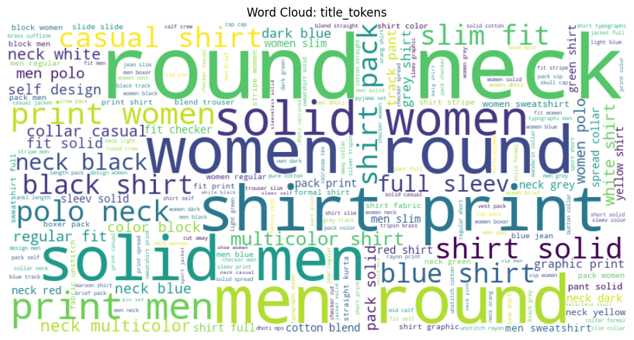

*Figure 4.1: Word cloud visualizations showing most frequent terms in title tokens*

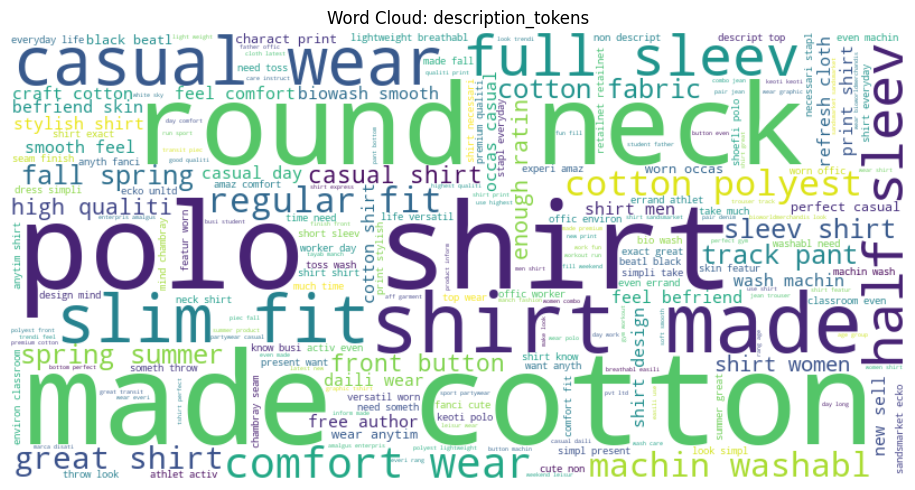

*Figure 4.2: Word cloud visualizations showing most frequent terms in description tokens*

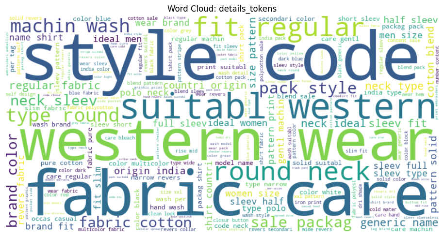

*Figure 4.3: Word cloud visualizations showing most frequent terms in product details tokens*

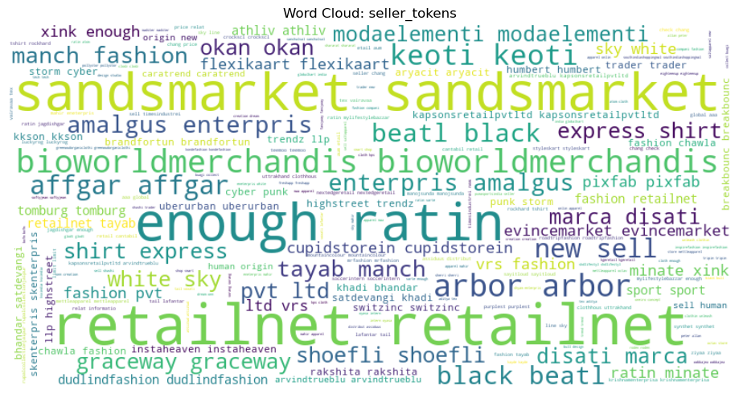

*Figure 4.4: Word cloud visualizations showing most frequent terms in seller tokens*

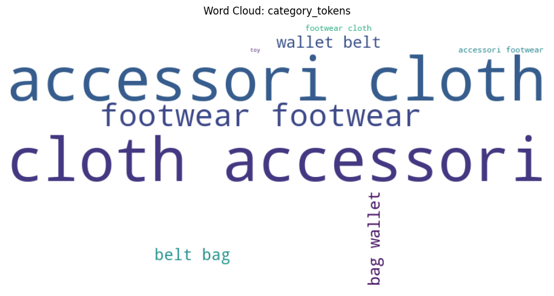

*Figure 4.5: Word cloud visualizations showing most frequent terms in category tokens*

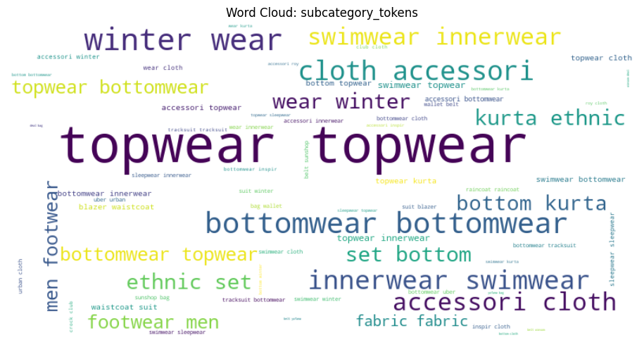

*Figure 4.6: Word cloud visualizations showing most frequent terms in sub category tokens*

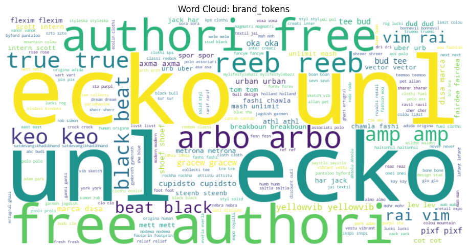

*Figure 4.7: Word cloud visualizations showing most frequent terms in brand tokens*

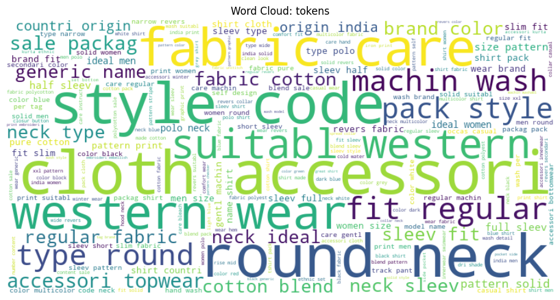

*Figure 4.8: Word cloud visualizations showing most frequent terms in all tokens combined*

### 4.3 Numeric Field Analysis

**Price Distribution:**
- **Selling Price**: min: 99, max: 7,999, mean: 705.64, median: 545, std: 549.68
- **Actual Price**: min: 150, max: 12,999, mean: 1,455.53, median: 1,199, std: 939.98

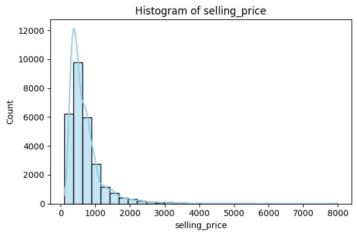

*Figure 4.9: Histogram distribution of selling price*

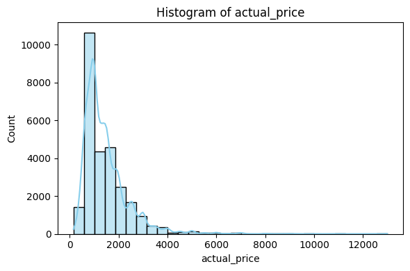

*Figure 4.10: Histogram distribution of actual price*

Both price distributions show a strong right skew, with most products concentrated in the lower price ranges (selling price peaks around 500-1000, actual price around 1000-1500), indicating the dataset predominantly features affordable fashion items with a long tail of premium products extending to luxury price points.

**Rating Analysis:**
- min: 1.0, max: 5.0, mean: 3.63, median: 3.8, std: 0.66

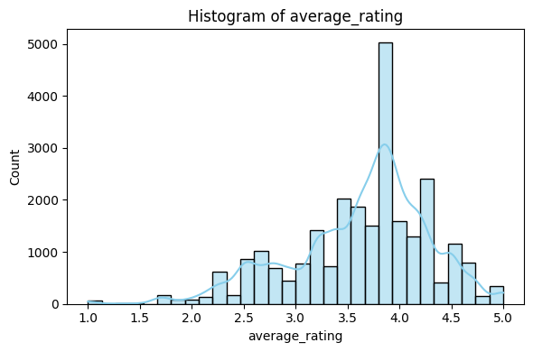

*Figure 4.11: Histogram distribution of average rating*

The rating distribution reveals a left-skewed pattern with a concentration around 3.5-4.0 stars, suggesting overall customer satisfaction with most products performing above average, while very low ratings (1-2 stars) are relatively rare.

**Discount Patterns:**
- **Discount Range**: 1% to 87% off
- **Mean & Median Discount**: mean: 50.26%, median: 53%
- **Standard Deviation**: 16.89%

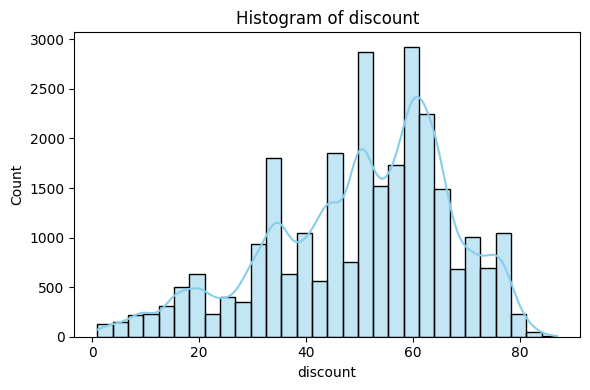

*Figure 4.12: Histogram distribution of discount*

The discount distribution shows a relatively uniform spread across the 30-70% range with a peak around 50-60%, indicating a consistent aggressive pricing strategy across the product catalog, with very few items offered at minimal discounts.

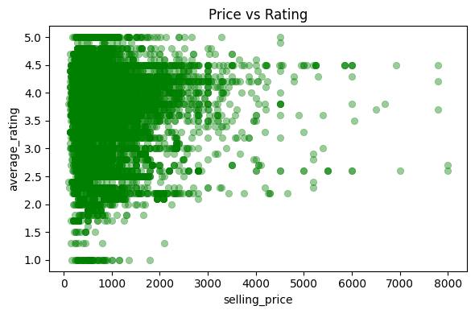

*Figure 4.13: Scatter plot showing relationship between selling price and average rating*

The scatter plot reveals no clear linear relationship between selling price and average rating, indicating that customer satisfaction is independent of price point (customers rate products based on quality and value rather than cost alone), with highly-rated products distributed across all price ranges.

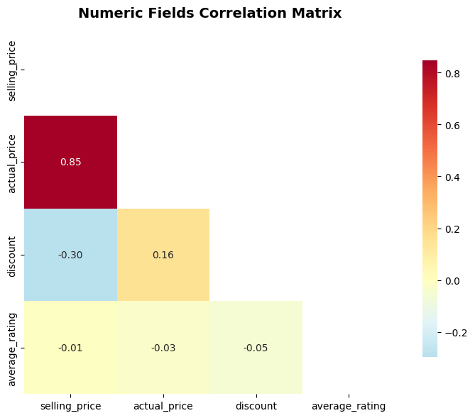

*Figure 4.14: Correlation matrix of numeric fields*

The correlation matrix shows a strong positive correlation between actual price and selling price (as expected), while average rating demonstrates weak correlations with price-related fields, confirming that customer satisfaction metrics operate independently from pricing strategies and discount levels.

### 4.4 Categorical Field Analysis

**Brand Distribution:**
- Mix of well-known brands and private labels
- Significant brand diversity across the catalog
- Some brands dominate market share

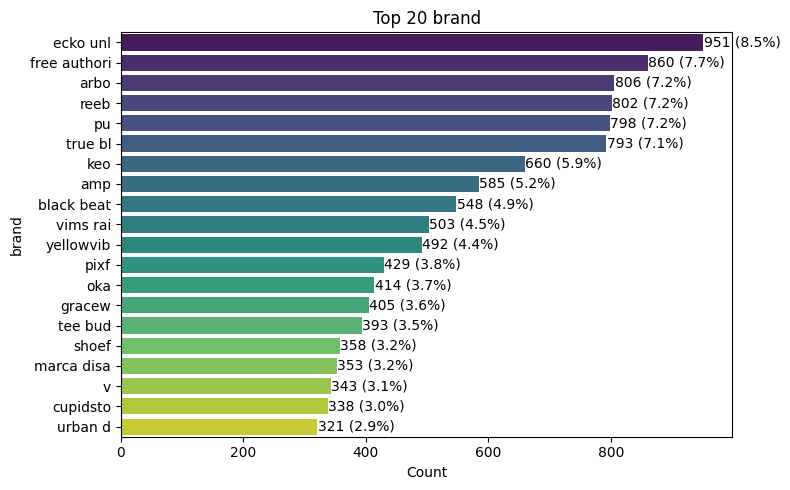

*Figure 4.15: Bar chart showing top brands by product count*

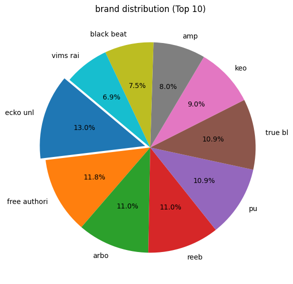

*Figure 4.16: Pie chart showing brand market share distribution*

The brand distribution reveals a fragmented market with several dominant players capturing significant shares, while numerous smaller brands contribute to a long tail, indicating both brand loyalty and competitive diversity within the fashion e-commerce space.

**Category Analysis:**
- **Category**: 7 unique categories with varying distribution
- **Subcategory**: 39 unique subcategories providing detailed classification
- **Pattern**: Some categories significantly more populated than others

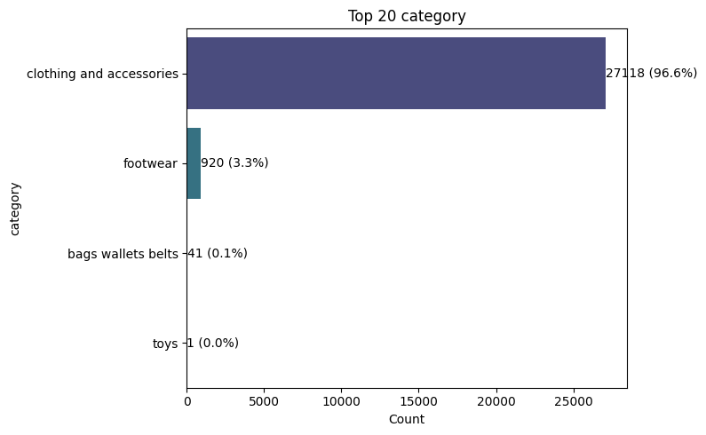

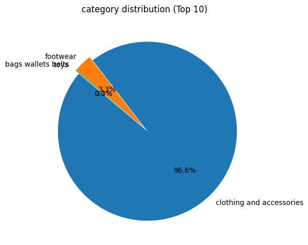

*Figure 4.17: Category distribution charts*

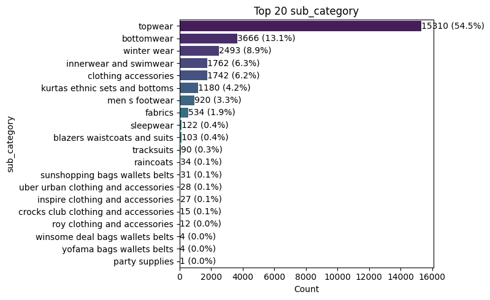

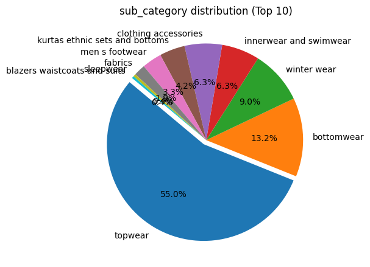

*Figure 4.18: Sub category distribution charts*

The category distributions show clear concentration patterns, with certain product categories (such as apparel and accessories) dominating the catalog, while the subcategory breakdown reveals more granular specialization, allowing for targeted search and recommendation strategies across diverse fashion segments.

**Seller Analysis:**
- Vendor distribution shows concentration patterns
- Mix of large and small sellers
- Some sellers dominate product offerings

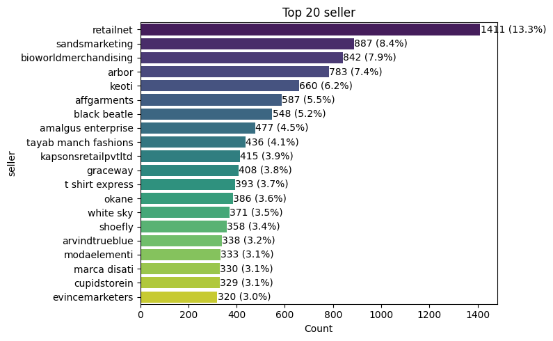

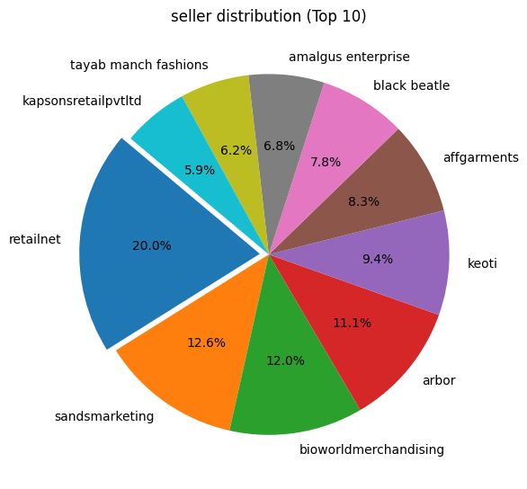

*Figure 4.19: Seller distribution analysis*

The seller distribution demonstrates a typical marketplace pattern with a few high-volume vendors accounting for the majority of products alongside numerous smaller sellers, suggesting a mix of established retailers and niche boutiques that collectively offer diverse product selections.

**Stock Availability:**
- **Out-of-stock ratio**: Calculated from boolean field analysis
- **Pattern**: Manageable stock levels with some seasonal variations

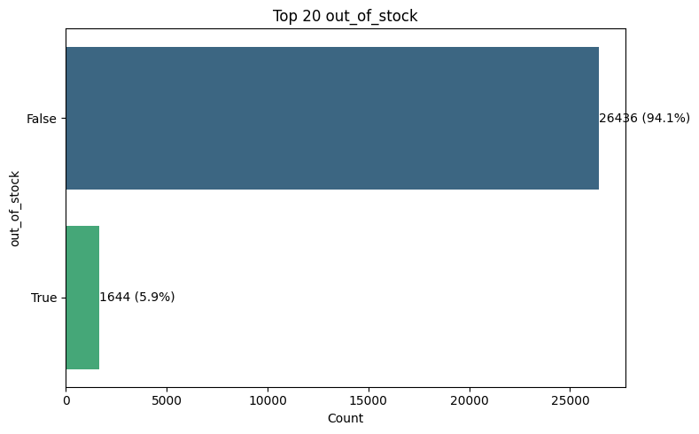

*Figure 4.20: Out of stock distribution analysis*

The stock availability distribution shows that the majority of products remain in stock, with a relatively small proportion of out-of-stock items, indicating effective inventory management practices that minimize missed sales opportunities while maintaining a diverse product catalog.

### 4.5 Top Products Analysis

**High-Value Products:**

The top 5 products by price range from 9,999 to 12,999 in actual price, all belonging to the "clothing and accessories" category. Interestingly, these luxury items exhibit moderate to good average ratings (2.6 to 4.5 stars), indicating that higher price does not guarantee superior customer satisfaction. The discount patterns on premium products are inconsistent, with some showing significant markdowns (20-40%) while others have no discount data, suggesting varied pricing strategies even within the luxury segment. Notably, one of the most expensive items (9,999, brand "reeb") is currently out of stock despite its low rating of 2.7, possibly indicating either supply chain issues or clearance of underperforming inventory. It is remarkable that 4 out of 5 of these products are out of stock, indicating either that these products are not produced in mass (and hence their exclusivity) or that people love acquiring such high-standing items. 

**Highly-Rated Products:**

The top-rated products all achieve perfect 5.0-star ratings but are significantly more affordable than the luxury segment, with actual prices ranging from 770 to 2,799. This reinforces the earlier correlation analysis finding that customer satisfaction is independent of price point (quality and value perception matter more than absolute cost). All highly-rated items also fall within the "clothing and accessories" category, feature diverse brands (col, viking ine, tee bud, true bl), and show varied discount patterns from minimal (7%) to substantial (61%) markdowns. The presence of multiple discount strategies across top-rated products suggests that aggressive discounting is not a prerequisite for achieving excellent customer reviews, and that product quality and meeting customer expectations are the primary drivers of high ratings.

---

## 5. Conclusion

This report documented the comprehensive data preparation and exploratory data analysis performed in Part 1 of the Information Retrieval and Web Analysis Final Project. We successfully:

### 1. Implemented a robust data preparation pipeline:
- Flexible data loading for different JSON formats
- Comprehensive text cleaning and normalization
- Multi-stage tokenization with stopword removal and stemming
- Numeric and categorical field processing

### 2. Developed a complete EDA framework:
- Dataset summary and quality assessment
- Text statistics and vocabulary analysis
- Numeric field distribution analysis
- Categorical field analysis and visualization
- Optional advanced features (word clouds, entity extraction)

### 3. Generated actionable insights:
- Understanding of dataset structure and quality
- Identification of preprocessing requirements
- Recognition of domain-specific characteristics
- Foundations for IR system design decisions

The processed dataset and analysis results are now ready for use in subsequent parts of the project.

All code is modular, well-documented, and reusable, following software engineering best practices for maintainability and extensibility.

AI tools were used to assist in generating the overall structure of main functions and report formatting. However, the code architecture, analytical methodology, and all strategic decisions were designed by the project team. Every AI-generated function was manually revised, debugged, and fine-tuned to ensure correctness and alignment with project requirements. All analytical insights, interpretations, and conclusions represent the team's understanding and work.